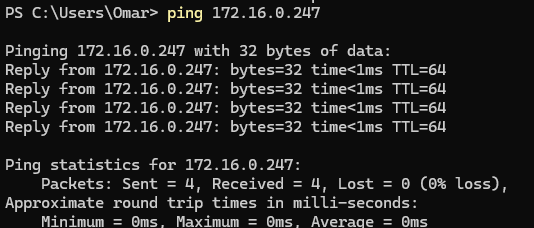
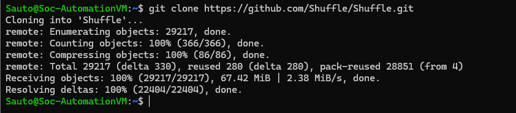
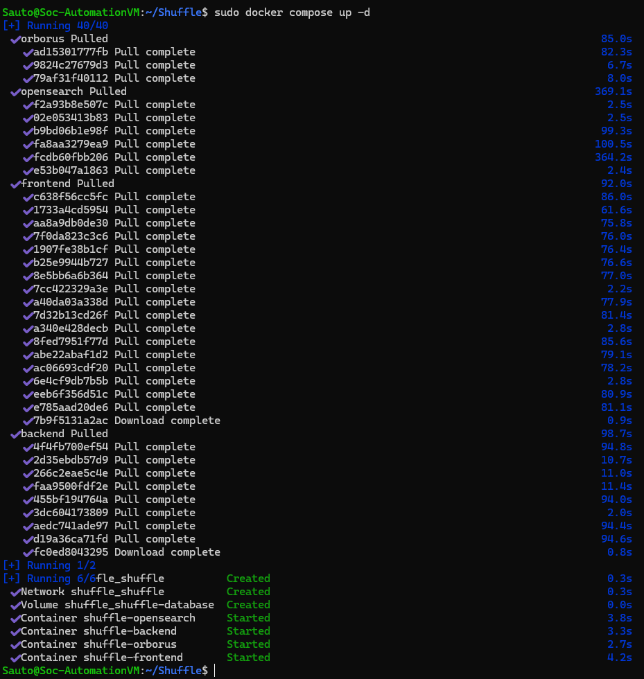
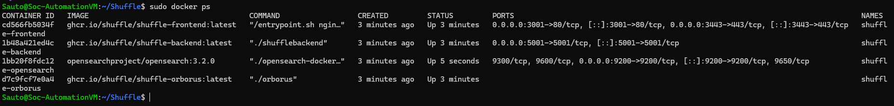
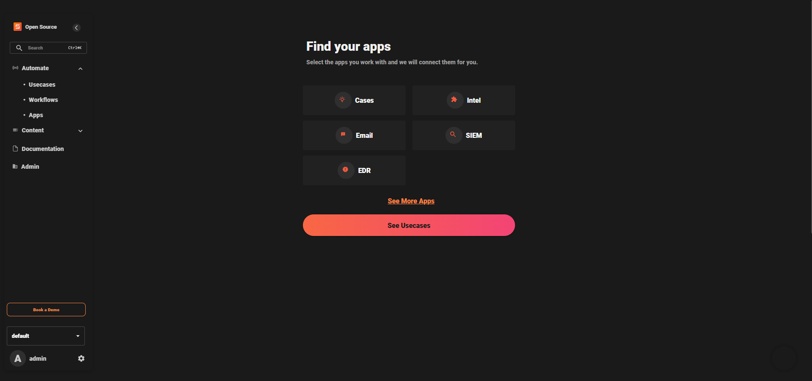
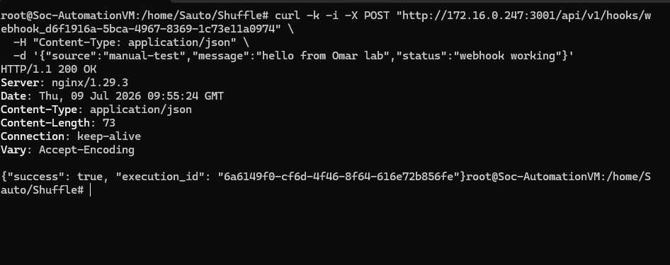
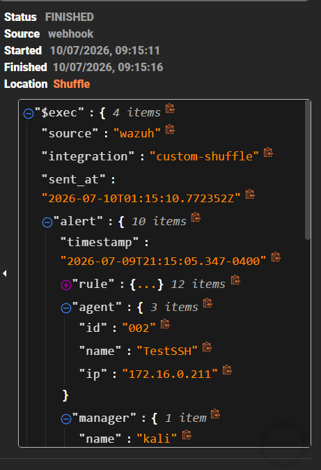
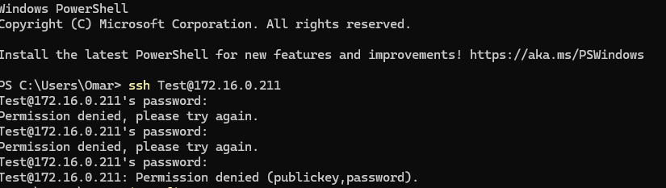
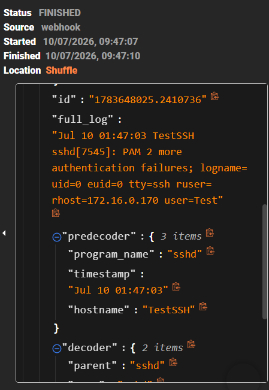

# Shuffle SOAR Setup

## Goal

Set up Shuffle SOAR as the automation and orchestration component of the DFIR lab.

Shuffle will receive Wazuh alerts through webhooks, process the alert data, perform threat-intelligence enrichment, and forward relevant alerts to TheHive.

## Steps Completed

* Created a dedicated Ubuntu VM for the SOAR and automation stack
* Configured the VM network and confirmed that it was reachable from the local lab
* Installed Docker Engine
* Installed Docker Compose
* Cloned the Shuffle repository
* Started the Shuffle stack
* Routed Wazuh Stack Logs into Shuffle using Python Script
* Added additional configuration to ossec/yml
* Connected both Wazuh Stack Log pipline to Shuffle Via Webhook
* Opened Shuffle UI to configure New Log Pipline Test
* Ran a simple SSH Failed log in Attempt to Test Shuffle Output

## Issues Faced

* Resourse Restriction and Limitation: was not able to configure both Shuffle and The Hive within a single VM

## Fixes Applied

Moved Shuffle to a new VM Dedicated to its servies alone

## Verification

Had setup the new VM and ensured that it was configured in a Bridged Adaptor in order for it to be accessible to the Local Network

Downloaded Shuffle and configured it all into a Docker container or Docker Compose as a standard setup

## Shuffle UI

## Testing Webhook Trigger From Wazuh Stack VM

## Sample Case

Attempting Multiple Failed SSH logins to Proc Webhook and Parse Log data from Wazuh to Shuffle Pipline

## What I Learned

* How Docker Compose manages several containers as one application stack
* Why Shuffle is deployed separately from the Wazuh Manager
* How Shuffle will act as the connection between Wazuh, threat intelligence, TheHive, and Velociraptor
* How to to automate a Proper Log pipline with Shuffle

## Current Status

Shuffle is green lit in the entire SOC Architecture 

